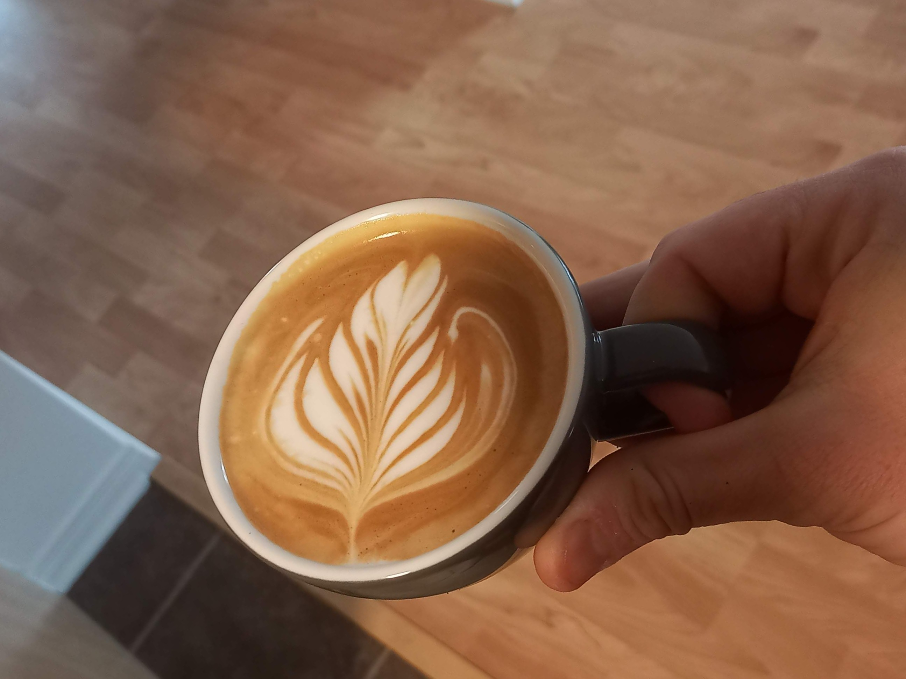
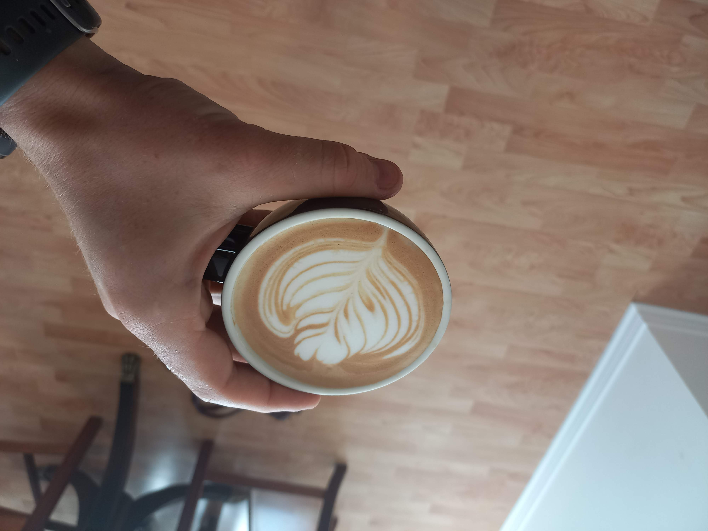
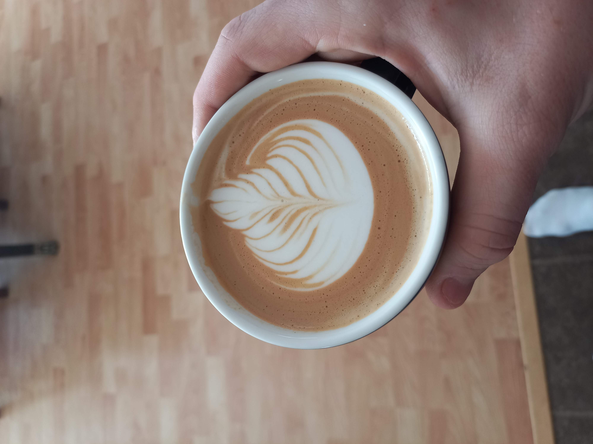
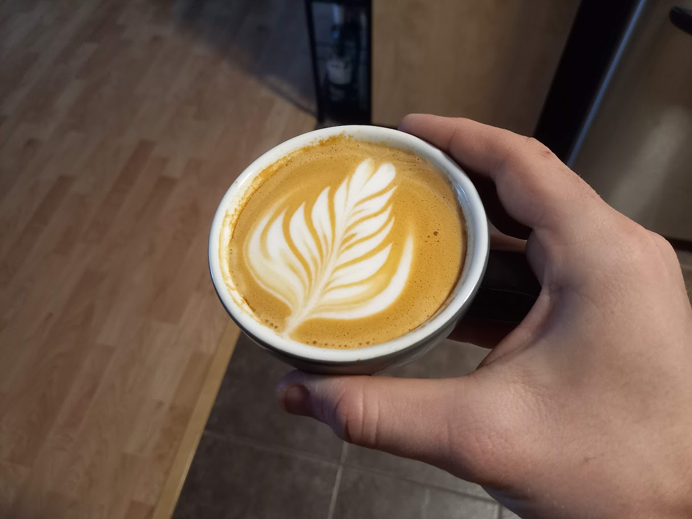
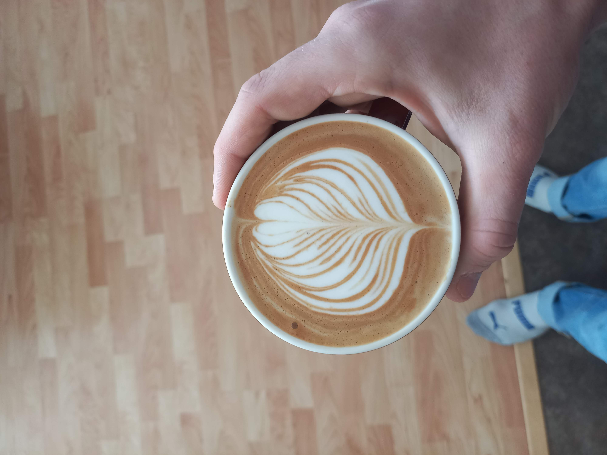

<!-- Here is some extra information about me! -->

<!-- 

  <a href="{{ site.baseurl }}/files/resume.pdf" download class="btn btn-primary">
    <i class="fa fa-download"></i> Download Resume
  </a>

 -->

## Interests & Hobbies
When I am not working on my research or robots, I spend a lot of time either at the rock climbing gym, playing tennis or running!
I have been rock climbing for about 10 years now, focussing mostly on indoor bouldering (no ropes, lower walls but more intense movements), although I've been lucky enough to climb on these incredibly nice cliffs in the region of Krabi, Thailand!

  
  

  <!-- 

 -->

  (Pictures taken from <a href="https://www.hittheroadjeanne.com/tonsai-beach-choses-a-savoir/" target="_blank">https://www.hittheroadjeanne.com/tonsai-beach-choses-a-savoir/</a>)

 
Apart from sports, I enjoy reading, playing chess and other board games, and learning new stuff!

## Latte Art (Just for Fun!)
As an engineering, I (obviously) have a deep passion (maybe obsession?) for coffee. My 3 coffees a day have given me lots of opportunities to practice and have fun with latte art, but its still a work in progress. After learning to make the heart and the tulip, I have recently been working on the rosetta (pictures below)... Next up, the swan!

  <!-- Row 1 -->
  
  
  

  <!-- Row 2 -->
  
  
  

 <!-- empty cell for symmetry -->

## Favorite Quotes
I tend to write down special quotes that have transformed the way I think, so here's a list of my favorite ones:
  - Success is the ability to go from failure to failure without a loss of enthusiasm. - Winston Churchill (?)
  - Un événement est aussi important que l'importance qu'on lui accorde. - My physics professor in college
  - You can do anything, but not everything. - David Allen
  - Thinking small is a self fulfilling prophecy. - Jeff Bezos
  - I fear not the man who has practiced 10,000 kicks once, but the man who has practiced 1 kick 10,000 times. - Bruce Lee
  - Luck is a dividend of sweat. The more you sweat, the more you get. - Ray Kroc