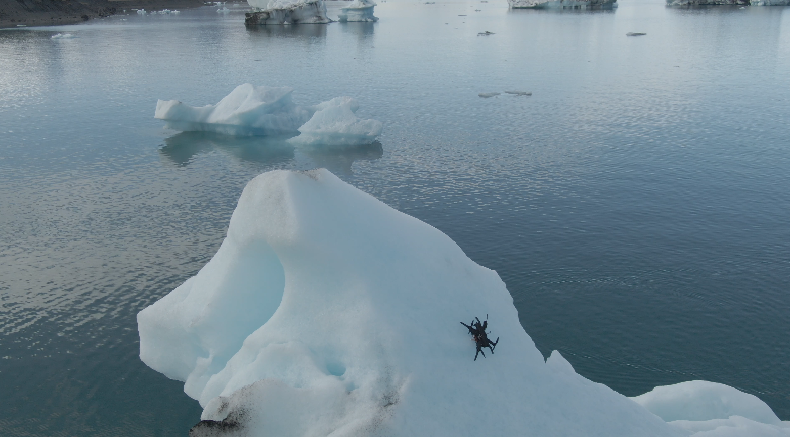
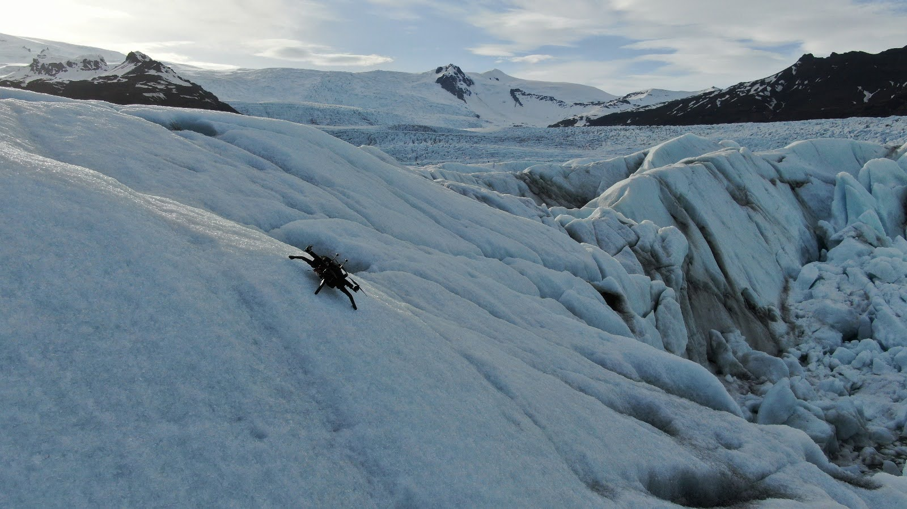
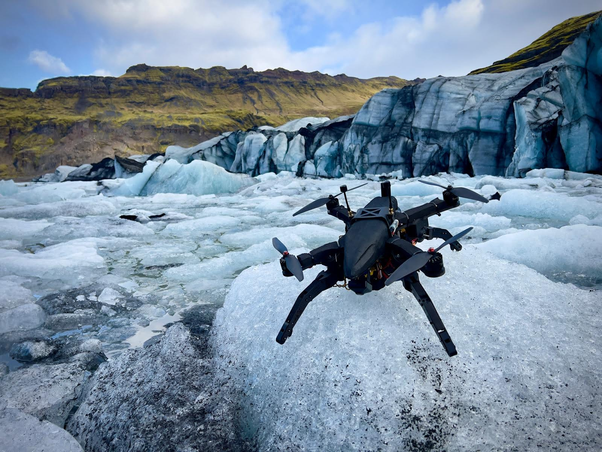

# PhD Research

## Friction-Based Dampers and Reverse Thrust to Land Multirotors on Steep Rooftops
Small paragraph about chapter 1 of my Masters/PhD research.  
Landing on rooftops:
<iframe width="560" height="315" src="https://www.youtube.com/embed/tG1K_63q00Y" frameborder="0" allowfullscreen></iframe>

## Upgraded Friction Shock Absorbers and Reverse Thrust to Land on High-Speed Ground Vehicles
Small paragraph on chapter 2 of my Masters/PhD research.    

Landing on a high-speed ground vehicle: 
<iframe width="560" height="315" src="https://www.youtube.com/embed/OHBPAHqLN08" frameborder="0" allowfullscreen></iframe>  

Landing on a moving canoe:
<iframe width="560" height="315" src="https://www.youtube.com/embed/E-ns-MxMJvU" frameborder="0" allowfullscreen></iframe>  

Landing on a vehicle in rough unpredictable terrain:
<iframe width="560" height="315" src="https://www.youtube.com/embed/jA9Zfpel1O8" frameborder="0" allowfullscreen></iframe>  

Landing on a pickup truck at the 3IT Lab (University of Sherbrooke): This scenario could represent a drone landing on a pickup truck after a delivery to get a ride from a nearby vehicle for multi-city delivery systems.
<iframe width="560" height="315" src="https://www.youtube.com/embed/hJn3TGY4muU" frameborder="0" allowfullscreen></iframe>  

Landing a drone on a pickup truck in very bumpy unpredictable dirt roads in the forest:
<iframe width="560" height="315" src="https://www.youtube.com/embed/_EjhQPquMnw" frameborder="0" allowfullscreen></iframe>  
  
## Spike-Equipped Friction Shock Absorbers and Reverse Thrust to Land on Steep Iceberg and Glacier Slopes
For phase 3 of my PhD research, I turned my focus towards the design of specialized spiked feet to enable drones to land on steep ice surfaces such as glaciers and icebergs. Again, using friction shock absorbers was proven essential to dampen the impact energy and ensure constant contact between the spikes and the ice, preventing rebounds. Reverse thrust was also key to landing success as it maintains the pressure needed for the spike to stay engaged in the ice during the post-impact sliding of the drone. The proposed solution allowed us to successfully land our drone on 24 icebergs/glaciers in Iceland during a 2-weeks field trial.

The demo video is coming soon!

  
  

  

<!-- The ability to land and stay on icebergs for long periods of time could enable the use of drones as remote sensors to track and monitor large icebergs coming towards offshore oil rigs in Eastern Canada's coastal regions, allowing companies to react proactively to avoid collisions and oil leaks in the ocean. These UAV-based missions have been explored by companies like C-Core in the past to replace current expensive solutions using manned aircraft to manually track incoming icebergs, but placing beacons or drones on icebergs has proven very challenging, due to the strong winds, slippery surfaces and icebergs' inherit risk of rolling. Placing a drone on a straight surface instead of an inclined one can also be dangerous because water puddles will form in these lower areas during warmer days. 
UAVs capable of landing on steep ice and snow could also be beneficial to explorers or rescue teams as a deployable tool to detect avalanches or weak ice structures in higher risk areas, and is also very relevant to space exploration, as extra-terrestrial robots often need to deal with icy/snowy terrain.
To deal with the challenging conditions of ice, I redesigned a new high-power drone (Thrust-to-Weight of 7) equipped with the same friction-based damping landing gear as used in previous work, and with the same reverse thrust implementation. I modified the feet of the landing gear with new specilized feet that use opposite retractable spikes made of hardened high-speed tool steel to penetrate the ice. These special feet allow the drone to successfully land at any yaw orientation relative to the slope, at angles up to 60°.
The novel landing strategy was field tested during 2 weeks in Iceland, in Solheimjokull and in Glacier Lagoon (Vatnajokull glacier), where managed to land the drone on 22 icebergs and 2 glaciers with zero crash.
The public demonstration video is coming, along with our paper on that topic! -->

